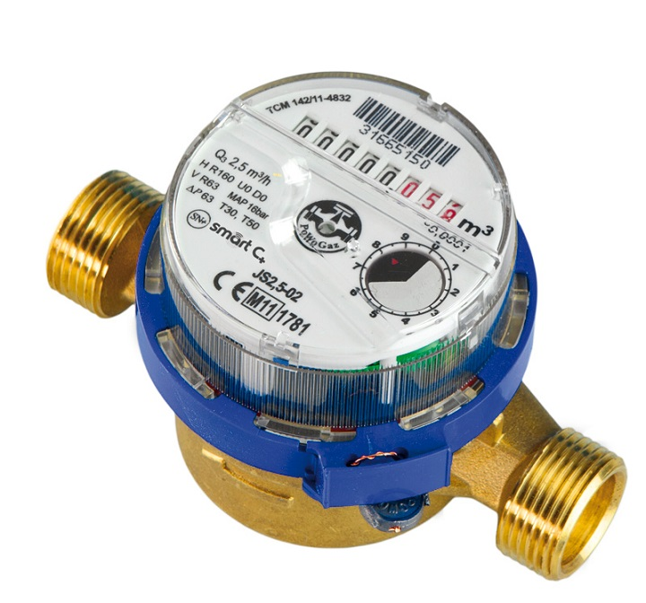

# watterpulsecounting - Pulse counting from water utilitymeter

I have utilitity meter for hot and cold water

The "clock meter" has a reflection part.

detekce otoceni kolecka (toho co vypada jako hodiny v pravo dole)

- je tem takova odraziva ploska (mezi 0 a 6.5),  diky ni funguje docela dobre detekce pres infra red cidlo
- jedno otoceni je jeden litr --> priblizne jsem schopen detekovat 0.5 l pulzy
    - graficky odecteno presneji to je 650ml a 350ml,
    - podle namerenych data 683-689 vs 310-316 (pustil jsem kohoutek a meril jsem casy mezi otackama)
- pokud potece 50l za sekundu
    - 20ms = 1/50 = 0.020 trva jedno otoceni kolecka
    - 13ms = 0.02*0.65  je odraziva cast
    - 7ms = je cerna cast
